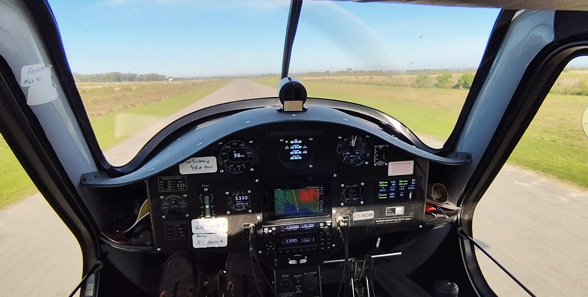
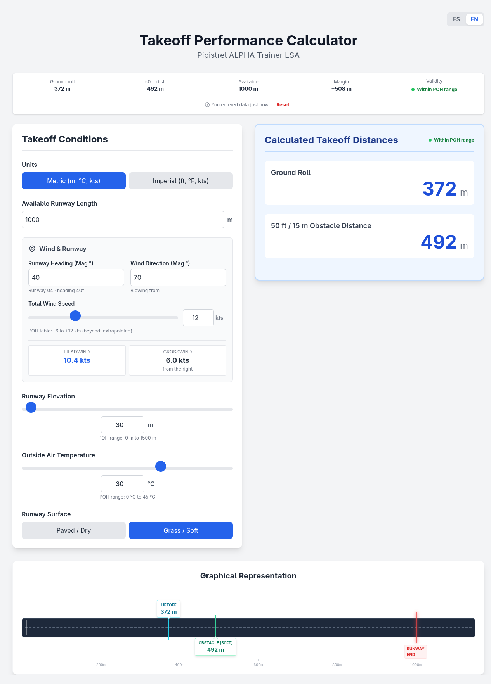

# Takeoff Performance Calculator - Pipistrel ALPHA Trainer

[](https://github.com/carlosplanchon/takeoff-performance-calculator-piat/actions/workflows/tests.yml)




<sub>Taking off from runway 13 at Colonia (SUCA), Uruguay. Photo by Carlos A. Planchón, Aero Club Mercedes. © 2026 Carlos A. Planchón, [CC BY 4.0](https://creativecommons.org/licenses/by/4.0/).</sub>

*Unofficial open-source project. Not affiliated with or endorsed by Pipistrel.
Always refer to current approved aircraft documentation for operational use.*

A self-contained, browser-based takeoff performance calculator for the
**Pipistrel ALPHA Trainer (LSA)**. It estimates the ground roll and the distance
to clear a 50 ft obstacle from elevation, temperature, wind and runway surface,
resolves the wind into its headwind and crosswind components from the runway
heading, and compares the result against the runway you actually have.

---

> **IMPORTANT DISCLAIMER AND WARNING**
>
> This calculator is an **educational and demonstrational tool only**. **DO NOT USE IT FOR REAL-WORLD FLIGHT PLANNING.**
>
> **SAFETY WARNING**: misusing takeoff performance tools can contribute to accidents resulting in serious injury or death, and/or property damage.
>
> The calculations are based on **POH-162-00-40-001, rev. A07** (ALPHA Trainer), sections 5.3 and 5.6. The ALPHA Trainer PRO is a different type with its own handbook and is **not** covered here.
>
> Always consult the official and current **Pilot's Operating Handbook (POH)** for your specific aircraft for accurate and authoritative performance data. **Any question about applying these calculations, or about using this tool in a training context, should be directed to a qualified and properly rated flight instructor.**
>
> The author assumes no liability for any decision made or action taken based on the use of this tool.

---



## Key Features

*   **Wind resolved from the runway heading:** you enter where the wind comes from and how hard it blows, not a headwind figure you worked out yourself. The tool derives the headwind or tailwind component and the crosswind, and says which side the crosswind is from.
*   **Says when it is extrapolating:** the handbook wind table runs from 6 kt of tailwind to 12 kt of headwind. Past that the tool keeps calculating and labels the result *extrapolated*, and beyond the temperature or elevation tables it refuses the result outright rather than clamping to the table edge and looking precise.
*   **Pending is not zero:** every input starts empty. No preloaded 15 °C that looks confirmed without being confirmed, and no verdict until the inputs that matter are in.
*   **The runway is part of the answer:** the margin against the runway you entered is shown with the distances, on a scale drawing, so the number that matters is the difference rather than the distance on its own.
*   **Every step visible:** the breakdown shows the base distance, the temperature and elevation corrections, the safety margin, and each factor applied, so the result can be followed back to the handbook.
*   **Bilingual:** English and Spanish.
*   **Imperial and metric:** switchable, with the conversion leaving pending fields pending.
*   **Session persistence:** the last session is restored from localStorage and labelled with its age.
*   **Self-contained:** no build step, no server, no external dependency at runtime. Every asset is vendored in `assets/`.

## Tech Stack

*   **HTML5** (semantic)
*   **[Tailwind CSS](https://tailwindcss.com/)** for the UI, built locally and vendored.
*   **[Alpine.js](https://alpinejs.dev/)** for reactivity and application logic.

## Running Locally

No build process is required.

```bash
git clone https://github.com/carlosplanchon/takeoff-performance-calculator-piat.git
cd takeoff-performance-calculator-piat
```

Then open `index.html` in your browser. Nothing is fetched at runtime, so opening
the file directly works; a local server is only needed for the test suite:

```bash
python3 -m http.server 8000
# http://127.0.0.1:8000/index.html
```

## Testing

The project has an in-browser test suite using **[QUnit](https://qunitjs.com/)**,
disabled by default. To run it, open `index.html` with the `?test=true`
parameter:

```
http://127.0.0.1:8000/index.html?test=true
```

Headless, the same way CI runs it:

```bash
./run_tests.sh
```

It serves the directory on an ephemeral port, loads the suite in headless
Chromium and exits non-zero if any assertion fails or the page never reports
results.

[VERIFICATION.md](VERIFICATION.md) records what has been checked, how, and what
that does and does not establish. It reports a mutation experiment measuring
what the suite would actually catch, and that experiment ships with the
repository rather than being quoted at you:

```bash
python3 verification/run_mutations.py
```

It introduces 37 deliberate defects one at a time and reports which part of the
suite catches each. The defects are in `verification/mutations.json` and the
recorded outcome in `verification/results.json`, which carries the SHA-256 of
the files it was measured over. CI checks that hash on every push, so a recorded
result cannot quietly drift away from the code it describes:

```bash
python3 verification/run_mutations.py --check   # milliseconds, not minutes
```

### What the suite covers

*   **POH source data** (sections 5.3 and 5.6): every figure in the code is
    written out again against the handbook it comes from, so editing a table cell
    without editing the check fails the suite.
*   **The wind table**: how a reading between two rows is interpolated, and what
    happens past the ends of the published range.
*   **Wind components**: the headwind, tailwind and crosswind derived from the
    runway heading and the wind direction, including which side the crosswind is
    from.
*   **Deterministic grid sweeps** across the supported ranges and their
    boundaries, pinning down relationships the calculation has to obey rather
    than single worked examples.
*   **Readiness and validity**: what counts as enough input to produce a verdict,
    and when the result is labelled extrapolated or refused outright.
*   **Persistence**: restoring a session, and corrupt payloads being ignored.

## Updating the vendored dependencies

Each dependency has a script that downloads it through npm (which verifies
sha512 integrity) and rewrites the references in `index.html`. None of them
commit anything.

```bash
./update_alpine.sh        # Alpine.js
./update_qunit.sh         # QUnit
./update_playwright.sh    # the CI Chromium pin
./generate_styles.sh      # rebuild assets/tailwind.css and stamp its hash
./run_tests.sh            # then check it is still green
```

## Related

**[Weight and Balance Calculator](https://github.com/carlosplanchon/weight-and-balance-calculator-piat)**,
the sibling tool for the same aircraft. It computes the takeoff and landing CG,
checks both against the envelope, and reads each aircraft's empty weight and arm
from its own approved documentation.

## Contributing

Contributions are welcome. If you find a bug or have a suggestion, open an
*Issue* or a *Pull Request*.

## License

The source code is distributed under the Apache License 2.0. See the `LICENSE`
file.

Two things in this repository are not covered by it. The vendored dependencies in
`assets/` keep their own licenses, set out in
[THIRD_PARTY_NOTICES.md](THIRD_PARTY_NOTICES.md). The banner photograph in
`assets/banner.jpg` is by the same author as the code but under a different
license: **CC BY 4.0**, which asks for the credit above to travel with the image
wherever it goes, including inside a copy of this project. Apache 2.0 asks for
no such thing, so the two cannot be assumed to be interchangeable.

Pipistrel and Textron Aviation are trademarks of their respective holders.
No rights to those trademarks are granted by this project.

---
*Made with ♥️ in Dolores, Soriano, Uruguay.*
